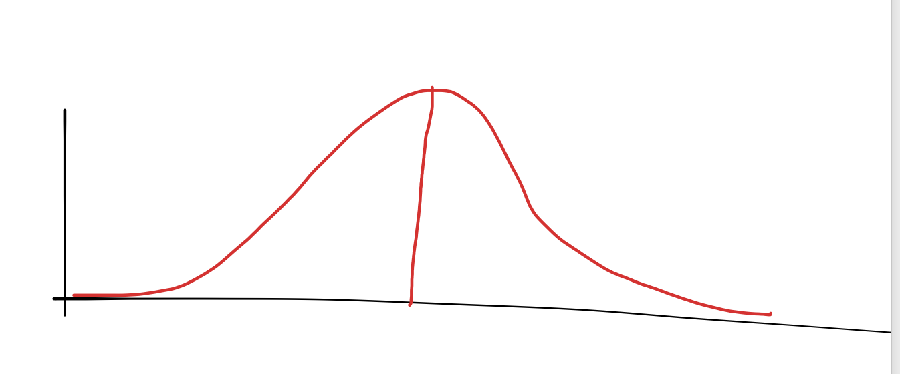

# Theoretical Interpretation of the Median and Mode

## Median
The median is the value on the horizontal axis (called x) for which the area under the probability density function graph  up to x is equal to 1/2.

A toy example is shown below...

## Mode

The mode refers to the maximum values in the probability density function. If there is more than one, e.g. two, then there are two modes and the data is bimodal.