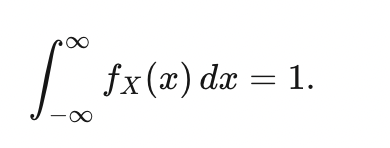
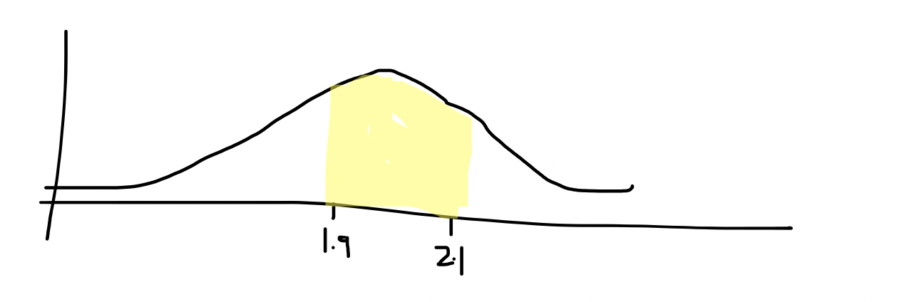

# Probability Density Functions for continuous data – Notes from Lecture

## What is a probability density function?

The probability density function for a continuous variable is best understood as giving the likelihood of an outcome that is on a continuum occurring (https://brilliant.org/wiki/continuous-random-variables-probability-density/). In simpler terms, we can imagine an event such as the amount of rain fall occurring tomorrow as a value best expressed on a continuous probability density function.

The probability that a value will fall between [a,b] is shown by the integral of a function, known as the probability density function f(x):

 

The probability of all events will not be more than 1.

## How is probability related to area under the curve

We can take the rainfall value as a good example of why probability in these instances is related to the area under curve. 

The probability that the EXACT amount of rainfall tomorrow is 2.000000000000000… inches is very low right. It’s much more likely that the rainfall may be between say 1.9 and 2.1. We can consider this probability a bit more meaningfully as 

P(1.9 < Y < 2.1)

If we want to find this probability, we need to find the area under the curve that represents these values – and that’s just integration!

∫1.9 2.1 fX(x)dx

Let’s show this on a little diagram for ease:

# What consequences follow regarding the probability of a particular value?

The probability of that single event happening, 2.000000000 is low. So with continuous variables, we measure the likelihood of an outcome falling within a range of values.

## Useful Links
https://brilliant.org/wiki/continuous-random-variables-probability-density/
https://www.khanacademy.org/math/statistics-probability/random-variables-stats-library/random-variables-continuous/e/probability-normal-density-curves
